# Blockchain Projects Portfolio


## Overview

This repository is an **educational portfolio monorepo** showcasing a collection of **independent blockchain projects**. The focus is on on-chain architecture, protocol design, and high-quality smart contract development across both Solana and Ethereum ecosystems.

---

## Solana Projects

⭐ marks **featured / flagship** projects that demonstrate complex system design.

| Project                                                                         | Type                             | Focus                                                                    |
| :------------------------------------------------------------------------------ | :------------------------------- | :----------------------------------------------------------------------- |
| [solana-config-program](solana-projects/solana-config-program/README.md)        | **Infrastructure / Registry**    | Global configuration accounts and deterministic PDA registry patterns.   |
| [solana-escrow-program](solana-projects/solana-escrow-program/README.md)        | **DeFi / Atomic Swap**           | Secure token swap logic using vault PDAs and atomic execution.           |
| [solana-token-manager](solana-projects/solana-token-manager/README.md)          | **Token Standards / Lab**        | Comparative study of SPL Token vs. Token-2022 extensions.                |
| [solana-nft-factory](solana-projects/solana-nft-factory/README.md)              | **Digital Assets / NFT Tooling** | Multi-flow NFT minting pipelines, metadata, and collection verification. |
| [solana-log-lab](solana-projects/solana-log-lab/README.md)                      | **Dev Tooling / Lab**            | Advanced runtime logging, event emission, and program diagnostics.       |
| [solana-price-oracle](solana-projects/solana-price-oracle/README.md)            | **Oracle / Infrastructure**      | Integration with Pyth Network using the pull-based oracle model.         |
| [solana-wallet-analyzer](solana-projects/solana-wallet-analyzer/README.md)      | **Data Tooling / Analytics**     | Off-chain TypeScript tool for wallet indexing and data enrichment.       |
| ⭐ [solana-employee-rewards](solana-projects/solana-employee-rewards/README.md) | **Enterprise Web3 / dApp**       | Full-scale rewards system with annual cycles, treasury, and NFT badges.  |

---

## Ethereum Projects

| Project                                                                             | Type                        | Focus                                                                     |
| :---------------------------------------------------------------------------------- | :-------------------------- | :------------------------------------------------------------------------ |
| [ethereum-token-standards](ethereum-projects/ethereum-token-standards/README.md)    | **Token Standards / Lab**   | Deep dive into ERC-20, ERC-721, and ERC-1155 reference implementations.   |
| [ethereum-amm-oracle-lab](ethereum-projects/ethereum-amm-oracle-lab/README.md)      | **DeFi Protocol / AMM Lab** | Constant-product AMM mechanics with slippage and oracle protection.       |
| ⭐ [ethereum-employee-voting](ethereum-projects/ethereum-employee-voting/README.md) | **Governance Engine**       | Modular voting primitives with stake-weighting and cross-chain potential. |

---

### ⭐ Featured Cross-Chain Integration

The featured projects represent the most comprehensive systems in this portfolio. Together, they form two complete and interconnected layers: a **governance voting application on Ethereum** and a **yearly employee reward system on Solana**.

In this architecture, the Ethereum-based **ethereum-employee-voting** project emits finalized governance outcomes. These outcomes are consumed by the Solana-based **solana-employee-rewards** program to mint special-purpose reward tokens as a post-cycle recognition mechanism based on employee-wide voting.

```mermaid

flowchart LR
%% =========================
%% Ethereum Governance Layer
%% =========================
subgraph ETH[Ethereum Governance Layer]
A[Ethereum Employee Voting]
A -->|Finalize Proposal| B[Governance Result]
B --> C[Event Emission]
end

    %% =========================
    %% Cross-Chain Messaging
    %% =========================
    subgraph CC[Cross-Chain Messaging Layer]
        C --> D[Wormhole Relayer]
        D -->|Verified Message| E[Cross-Chain Payload]
    end

    %% =========================
    %% Solana Reward Layer
    %% =========================
    subgraph SOL[Solana Reward Execution Layer]
        E --> F[Solana Employee Rewards Program]
        F --> G[Reward Settlement Logic]
        G --> H[Mint Special-Purpose Reward Tokens]
    end
```



**Source Code Access**
The full source code for these flagship projects is maintained privately and can be reviewed in controlled evaluation settings, such as technical interviews, guided walkthroughs, or private screen-sharing sessions.

---

## Project Structure

- `solana-projects/` – Rust-based programs built with the Anchor framework.
- `ethereum-projects/` – Solidity smart contracts built with Hardhat and Foundry.

---

## How to Navigate

Each project is designed to be self-contained for easier auditing and review. Inside each directory you will find:

- `programs/`, `src/`, or `contracts/` – Core on-chain logic and smart contracts.
- `tests/` – Comprehensive test suites (Foundry, Hardhat, or Anchor/Mocha).
- `README.md` – Technical documentation, architectural diagrams, and setup guides.

---

## Design Principles

- **Modular Architecture:** Separation of concerns through interface-driven design and decoupled state management, ensuring system extensibility.
- **Defensive Programming:** Implementation of strict access controls, rigorous state validation, and custom error handling to mitigate on-chain attack vectors.
- **Standard Compliance:** Strict adherence to core protocol standards (ERC, SPL, Token-2022) to ensure seamless interoperability across the Web3 ecosystem.
- **Verification & Testing:** Commitment to high code quality through layered testing strategies, encompassing unit logic (Foundry/Anchor) and end-to-end integration flows.

> Some modules intentionally favor explicit comments, visually traceable tests, and simplified logic to emphasize conceptual clarity and protocol behavior over production-level optimization.

---

## Environment & Tools

- **Solana Stack:** Rust, Anchor Framework, Solana CLI.
- **Ethereum Stack:** Solidity, Hardhat, Foundry, Ethers.js v6.
- **Infrastructure:** Pyth Network, Wormhole, Helius, Birdeye APIs.

---

## Disclaimer

This repository is for **educational and portfolio purposes only**. The code is not audited and should not be used in production environments involving real financial assets.

```

```
